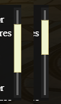
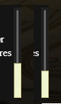
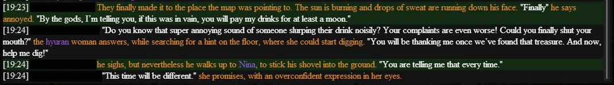
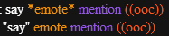
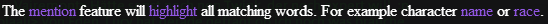

# Gobchat (FFXIV chat overlay)
Gobchat is an overlay with the goal to provide a better chat experience for roleplayers.

This app took a lot of inspiration from [quisquous cactbot](https://github.com/quisquous/cactbot)
and uses the great [sharlayan](https://github.com/FFXIVAPP/sharlayan) module from FFXIVAPP to process FFXIV's memory.

The changelog can be found [here.](CHANGELOG.md)

Die deutsche Version dieser Readme kann man [hier](README_de.md) finden.

1. [Features](#features)
   1. [Smart Autoscroll](#smart-autoscroll)
   1. [Text formatting](#text-formatting)
   1. [Chat tabs](#chat-tabs)
   1. [Text-Highlighting](#text-highlighting-for-key-words---mentions)
   1. [Draggable and Resizeable](#draggable-and-resizeable)
   1. [Chat Log](#chat-Log)
   1. [Range Filter](#range-filter)
   1. [Groups](#groups)
   1. [Chat Commands](#chat-commands)
1. [Installation](#installation)
1. [Updating Gobchat](#updating-gobchat)
1. [How to use Gobchat](#how-to-use-gobchat)
1. [Troubleshooting](#troubleshooting)
1. [License](#license)

## Features

### Smart autoscroll
By moving the scroll bar up, autoscroll will be disabled for new messages and you can (re)read the text, without any disturbance.

By moving the scroll bar back to the bottom of the chat, autoscroll will be re-enabled!

### Text formatting
Enhance your chat experience with colors! They make it easier to follow other people actions.

Will be turned into this:

### Chat tabs
Create as many tabs as you like and control which channels are visible and what formatting to apply

#### Roleplay specific formatting
Gobchat applies specific colors to speech, emote and ooc comments

### Text-Highlighting for key words - mentions
Case-insensitive detection for a customizable list of words, which then will be highlighted. This will help you not missing out on important messages.

This feature can be enhanced further by playing a customizable sound.
Sound files must be placed in `Gobchat\resources\sounds`.

### Customizable formatting settings

### Draggable and Resizeable
Click on the overlay to put the focus on it. By pressing and holding left-ctrl the drag- and resize-mode is activated. Indicated by a light, blue hue.
To drag the overlay, simply press and hold your left mouse button and drag.
To resize, move your mouse to one of the four borders or corners of the overlay. The cursor will change, indicating the type of resizing. Now press and hold the left mouse button and resize.

### Chat Log
Gobchat can write your chat history to a file, preserving informations you might want to look up later or just to reread fun moments.
They can be found under `AppData\Roaming\Gobchat`.

Each time Gobchat is started it will create a new file.
By default this feature is deactivated. If you want that Gobchat creates a log file, activate it in the settings.

### Range filter
Filter messages in various channels by distance to the writer. Remove them completely and/or fade them slowly out the farther away they are. The numbers are given in yalms (in game unit). And the degree of fade out effect is computed by the distance between fade out and cut off.

By default this feature is deactivated. You can turn it on in the settings.

### Groups
The game allows you to sort players from your friend-list into seven predefined groups. Doing so, marks said players with a special icon in your chat, making it easier to keep track of them.

Gobchat includes these groups into its styling options and allows to create as many additional groups as you want.
Each group can have a name, activated or deactivated, styled and keeps track of the players which belong to it.
It's no longer required to add players to your friend-list, just to make it easier to see what they're writing.

Groups are sorted by importance. While a player can belong to multiple groups, only the style of the first matching group is applied. To change the order, just drag & drop the group to its new position.

### Chat Commands
Gobchat accepts chat commands. To send a chat command to Gobchat, use the echo channel `/e` and type `gc` (short for Gobchat!).
Example:
- `/e gc `

Gobchat supports the following chat commands:
- [group](#chat-command-group)
- [profile](#chat-command-profile)
- [close](#chat-command-close)
- [player](#chat-command-player)
- [config](#chat-command-config)
- [info/error](#chat-command-info--error)

***

#### Chat command Group
Usage:
- `/e gc group groupnumber add/remove/clear playername`

This chat command can be used to manipulate a player group without using the config menu, for example via macros.
To use the group command, type `/e gc group`.

Groupnumber is a number, starting from 1 and references the group you want to manipulate. The assigned number is identical to the position in the config menu.

Next is the task which should be performed. Possible values are `add`, `remove` and `clear`

##### clear
Doesn't need any additional  arguments. This task will remove all players from a group.
Example:
- `/e gc group 3 clear` - will remove all players from group 3

##### add
Needs the full name of a player, which will be added to the group. Names are case-insensitive!
When a player comes from a different server, it is also necessary to specify the server name in brackets.
Placeholders like <t> are an exception to this rule and will always be accepted.

Examples:
- `/e gc group 1 add M'aka Ghin` 			/ `/e gc group 1 add firstname lastname`
- `/e gc group 1 add M'aka Ghin[ultros]` 	/ `/e gc group 1 add firstname lastname[servername]`
- `/e gc group 1 add M'aka Ghin [ultros]` 	/ `/e gc group 1 add firstname lastname [servername]`
- `/e gc group 1 add <t>`

##### remove
Needs the full name of a player, which will be removed to the group. Names are case-insensitive!
When a player comes from a different server, it is also necessary to specify the server name in brackets.
Placeholders like <t> are an exception to this rule and will always be accepted.

Examples:
- `/e gc group 1 remove M'aka Ghin` 			/ `/e gc group 1 remove firstname lastname`
- `/e gc group 1 remove M'aka Ghin[ultros]` 	/ `/e gc group 1 remove firstname lastname[servername]`
- `/e gc group 1 remove M'aka Ghin [ultros]` 	/ `/e gc group 1 remove firstname lastname [servername]`
- `/e gc group 1 remove <t>`

#### Chat command Profile
Usage: `/e gc profile load profilename`\
This chat command can be used to change the active profile and can be easily embedded in a macro, especially useful if you already use a macro to activate your rp flag!

Examples:
- `/e gc profile load Favorite Profile`\
this will activate the profile with the name `Favorite Profile`

#### Chat command Close
Usage: `/e gc close`\
This chat command will close Gobchat and provides an alternative way to right-clicking the Gobchat Icon in the tray-icon bar and clicking close.

#### Chat command Player
##### count
Usage: `/e gc player count`\
Returns the number of characters nearby. The definition of nearby depends on the total amount of characters close to you. The client will only display up to 100 characters.

##### list
Usage: `/e gc player list`\
Returns a list of character names and their current distance to you.

##### distance
Usage: `/e gc player distance <t>`\
Returns the distance in yalms to your current target.

#### Chat command config
##### open
Usage: `/e gc config open`\
This allows to open the config dialog via chat command
Usage:

##### reset frame
Usage: `/e gc config reset frame`\
Resets size and position of the overlay to its default value

#### Chat command info / error
Usage:
- `/e gc info on`
- `/e gc info off`
- `/e gc error on`
- `/e gc error off`

Will temporarily deactivate Gobchat's info and error messages.

## Installation

### Dependencies

Install [.NET Framework](https://www.microsoft.com/net/download/framework) version 4.7.2 or above

Visual C++ Redistributable Packages
Install [redistributables x64](https://aka.ms/vs/16/release/vc_redist.x64.exe) for 64-bit Windows
Install [redistributables x84](https://aka.ms/vs/16/release/vc_redist.x86.exe) for 32-bit Windows

### Installing Gobchat

1. Go to [latest release](https://github.com/marblebag/gobchat/releases/latest)
2. Download the latest version of Gobchat. The file is named gobchat-{version}.zip
3. Right click the zip file and go to properties. In the bottom right corner of the properties menu, click `Unblock`, and then "OK" to close the menu
4. Unzip the zip file to your preferred location. All files are already in a Gobchat folder.
5. Go into your Gobchat folder
6. Start Gobchat.exe
7. On start Gobchat will check for new updates
8. On the first start of Gobchat it will try to download CEF. CEF is a browser engine and runs Gobchats UI, which is written in HTML and Javascript

### Updating Gobchat

On startup Gobchat will check for new updates. The installation can be done either manually or automatically.
To do it manually repeat steps 1 to 4 of [installing Gobchat](#installing-gobchat) and replace all files.
To do it automatically hit the automatic install button on the patch-note screen. Done.

## How to use Gobchat
### Running
1. Gobchat's Overlay will not be visible in front of FFXIV, when FFXIV runs in full screen mode.  
2. Gobchat was written for FFXIV 64bit - DirectX 11 version

1. Go into your Gobchat folder
2. Start Gobchat.exe
3. On start Gobchat checks for new updates

Within your tray a new icon will appear: 
This icon means Gobchat is running and looks for an active instance of FFXIV.

If you are running FFXIV and Gobchat finds it, the icon will switch to , indicating that Gobchat is ready.
This may take a while on your first start of Gobchat.

### Tray Icon
- Left click: Will show or hide the overlay
- Right click: Will open a context menu

### Closing
1. Right click the tray icon of Gobchat.
2. Click 'close'!

1. Use a chat command in FFXIV
1. enter `/e gc close` in the in-game chat

## Troubleshooting
### Range filter seems not to work
- Check `Config / App`, it's possible that Gobchat can't retrieve informations about players from your running FFXIV. A red message will inform you about that. This can have many reasons:
  - Be sure FFXIV is running.
  - Close and reopen config dialog. Gobchat needs some time until it has loaded everything.
  - Close Gobchat an delete the `sharlayan` folder under `resources`.  The content will be re downloaded and may contain the missing informations.

### Gobchat doesn't start
- Check `gobchat_debug.log`
  - An error like `System.IO.FileNotFoundException` in combination with `CefSharp.Core.dll` indicates a problem with CEF.
    - There is a good chance that `Visual C++ Redistributable` is missing. Check [Dependencies](#dependencies).

## License
This program is free software: you can redistribute it and/or modify it under the terms of the GNU Affero General Public License (AGPL-3.0-only) as published by the Free Software Foundation, version 3.
You can find the full license [here](LICENSE.md) or at https://www.gnu.org/licenses/
