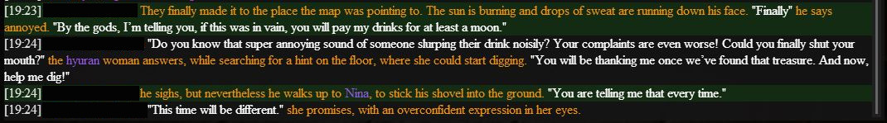
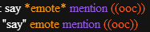

# Gobchat (FFXIV chat overlay)
Gobchat ist ein Overlay mit dem Ziel den Chat für Rollenspieler angenehmer zu machen.

Die Umsetzung dieser Software wurde inspiriert von [quisquous cactbot](https://github.com/quisquous/cactbot)
und verwendet [sharlayan](https://github.com/FFXIVAPP/sharlayan) module von FFXIVAPP um den Speicher von FFXIV zu verarbeiten.

Die Patchnotes können [hier](CHANGELOG.md) gefunden werden. (Englisch!)

The english version of this readme can be found [here.](README.md)

1. [Features](#features)
   1. [Smart Autoscroll](#smart-autoscroll)
   1. [Textformatierung](#textformatierung)
   1. [Texthervorhebung für Schlüsselwörter - Erwähnungen](#texthervorhebung-für-schlüsselwörter---erwähnungen)
   1. [Zieh- and Größenverstellbar](#zieh--und-größenverstellbar)
   1. [Chat Log](#chat-log)
   1. [Gruppen](#gruppen)
   1. [Chat-Befehle](#chat-befehle)
1. [Installation](#installation)
1. [Gobchat updaten](#gobchat-updaten)
1. [Gobchat verwenden](#gobchat-verwenden)
1. [License](#license)

## Features

### Smart autoscroll
Durch Hochscrollen des Scrollbalkens wird das automatische Scrollen deaktiviert. So können auch ältere Texte ohne Störung (nochmals) gelesen werden.

Bewegt man den Scrollbalken ganz nach unten, wird das automatische Scrollen wieder aktiviert.

### Textformatierung
Verbessere die Chat-Übersicht mit Farben! So sind RP-Texte leichter zu lesen und Beschreibung von Gesagtem schneller zu unterscheiden.

Wird zu:

#### Rollenspiel spezifische Formatierung
Gobchat weist Sprache, Emote und OOC-Kommentaren, spezielle/eigene Farben zu.

### Texthervorhebung für Schlüsselwörter - Erwähnungen:
Eine anpassbare Liste an Wörtern, die ungeachtet der Groß- und Kleinschreibung, markiert werden. Das soll dabei helfen, keine wichtigen Nachrichten mehr zu übersehen.

### Anpassbare Formatierungseinstellungen

### Zieh- und Größenverstellbar
Klicke auf das Overlay, um den Fokus darauf zu setzten. Durch gedrückthalten der linken STRG Taste wird das Overlay in der Größe verstellbar und kann auch verschoben werden. Dies wird durch eine leicht bläuliche Schattierung des Overlays dargestellt.
Zum Verschieben einfach den linken Mauszeiger gedrückt halten und das Overlay an die gewünschte Stelle ziehen.
Um die Größe zu verändern, den Mauszeiger zu einer der Ecken des Overlays bewegen. Der Cursor ändert dort sein aussehen. Dann den rechten Mauszeiger gedrückt halten und die Größe von der Ecke aus verändern. 

### Chat Log
Gobchat kann den Chatverlauf in eine Datei schreiben und so zu einer späteren Ansicht abspeichern. So können Details oder lustige Momente auch zu einem späteren Zeitpunkt nochmal nachgelesen werden.
Diese sind unter AppData\Roaming\Gobcha zu finden.

Jedes Mal, wenn Gobchat gestartet wird, wird eine neue Datei für das Log angelegt.
Standardmäßig ist diese Einstellung deaktiviert, kann aber unter den Einstellungen des Overlays aktiviert werden.

### Gruppen
Das Spiel erlaubt es bereits Spieler in sieben vordefinierte Gruppen zu unterteilen. Dadurch werden Spieler im Chat mit einem speziellen Symbol markiert und können so leichter im Chatverlauf wiedergefunden werden. 

Gobchat schließt diese Gruppen in seine Einstellungsmöglichkeiten mit ein und erlaubt zusätzlich beliebig viele eigene Gruppen zu erstellen.
Jede Gruppe kann ihren eigenen Namen haben, angepasst werden und aktiviert oder deaktiviert werden.  Spieler innerhalb der Gruppe werden je nach gewählter Einstellung auf bestimmte Weise im Chat hervorgehoben.
So müssen Spieler nicht länger der Freundesliste hinzugefügt werden, um ihr Geschriebenes im Chat leichter zu finden.

### Chat-Befehle
Gobchat akzeptiert Chat-Befehle.  Um einen Befehl an Gobchat zu senden wird der echo Channel /e genutzt gefolgt von gc (kurz für Gobchat).
Beispiel:
- `/e gc `

Gobchat unterstützt folgende Befehle:
- [group](#group)

***

#### group
Nutzung:
- `/e gc group Gruppennummer add/remove/clear Spielername`)

Dieser Befehl kann genutzt werden, um Spieler einer Gruppe hinzuzufügen oder sie daraus zu entfernen, ohne das Konfigurations-Menü dafür zu öffnen, z.B. durch die Nutzung von Makros. 
Um den Grupppen-Befehl zu nutzen, tippe: /e gc group

Die Gruppen-Nummer beginnt bei der Zahl 1 und steht für die Gruppe, die verändert werden soll.  Die zugewiesene Nummer ist identisch mit der Position der Gruppe im Kunfigurations-Menü.

Der nächste Teil des Befehls steht für die Aktion die ausgeführt werden soll.  Mögliche Aktionen sind:
add (hinzufügen), remove (entfernen), clear (bereinigen/löschen)

##### clear
Braucht keinen weiteren Zusastz. Diese Aktion wird alle Spieler aus einer Gruppe entfernen.
Beispiel:
- `/e gc group 3 clear` - entfernt alle Spieler aus Gruppe 3

##### add
Benötigt den vollständigen Spielernamen des Spielers, der zur Gruppe hinzugefügt werden soll. Groß- und Kleinschreibung spielt bei Namen keine Rolle.
Kommt der Spieler von einem anderen Server, ist es zusätzlich notwendig den Servernamen in eckigen Klammern hinzuzufügen.
Der Platzhalter <t> für das aktuelle Ziel wird auch akzeptiert.

Beispiele:
- `/e gc group 1 add M'aka Ghin` 			/ `/e gc group 1 add vorname nachname`
- `/e gc group 1 add M'aka Ghin[shiva]` 	/ `/e gc group 1 add vorname nachname[servername]`
- `/e gc group 1 add M'aka Ghin [shiva]` 	/ `/e gc group 1 add vorname nachname [servername]`
- `/e gc group 1 add <t>`

##### remove
Benötigt den vollständigen Spielernamen des Spielers, der aus der Gruppe entfernt werden soll. Groß- und Kleinschreibung spielt bei Namen keine Rolle.
Kommt der Spieler von einem anderen Server, ist es zusätzlich notwendig den Servernamen in eckigen Klammern hinzuzufügen. 
Der Platzhalter <t> für das aktuelle Ziel wird auch akzeptiert.

Beispiele:
- `/e gc group 1 remove M'aka Ghin` 			/ `/e gc group 1 remove vorname nachname`
- `/e gc group 1 remove M'aka Ghin[shiva]` 		/ `/e gc group 1 remove vorname nachname[servername]`
- `/e gc group 1 remove M'aka Ghin [shiva]` 	/ `/e gc group 1 remove vorname nachname [servername]`
- `/e gc group 1 remove <t>`

## Installation

### Erforderliche Programme

Installiere [.NET Framework](https://www.microsoft.com/net/download/framework) version 4.7.2 oder höher

Die neuste Visual C++ Redistributable Packages (download startet direkt)
Installiere [redistributables x64](https://aka.ms/vs/17/release/vc_redist.x64.exe) für 64-bit Windows
Installiere [redistributables x84](https://aka.ms/vs/17/release/vc_redist.x86.exe) für 32-bit Windows

### Installation von Gobchat

1. Besuch die Seite mit der [neusten Version](https://github.com/marblebag/gobchat/releases/latest) von Gobchat
2. Lade die neuste Version von Gobchat herunter. Die Datei heißt 'gobchat-{version}.zip'
3. Mache einen Rechtsklick auf die Zip Datei und gehe zu „Eigenschaften/Properties“.  Unten rechts in der Ecke des Eigenschaften Menüs auf „Unblock/freigeben“ klicken. Dann auf ok, um das Menü zu schließen.
4. Die zip Datei am gewünschten Ort entpacken. Die Datei enthält einen Ordner mit dem Namen Gobchat.
5. Wechsel in den Ordner Gobchat
6. Starte die Gobchat.exe
7. Bei jedem Start prüft Gobchat ob neue Updates verfügbar sind
8. Beim ersten Start versucht Gobchat CEF herunterzuladen. CEF ist ein eingebetteter Browser und nötig für die UI von Gobchat, die in HTML und Javascript geschrieben ist.

### Gobchat updaten

Aktuell müssen diese Schritte noch von Hand durchgeführt werden.

1. Wiederhole die Schritte 1 bis 4 der [Installation](#installation-von-gobchat) und ersetzte einfach alle Dateien.
2. Schon fertig!

## Gobchat verwenden
### Gobchat starten
1. Wechsel in deinen Gobchat Ordner
1. Starte die Gobchat.exe
1. Bei jedem Start prüft Gobchat ob neue Updates verfügbar sind

In deiner Tray (Icons unten rechts) wird ein neues Icon erscheinen: 
Das bedeutet Gobchat läuft und sucht nach einer aktiven Instanz von FFXIV

Wenn FFXIV läuft und Gobchat findet FFXIV, dann wechselt das Icon zu 
Gobchat ist jetzt bereit. Das kann beim ersten Start von Gobchat eine Weile dauern.

### Tray Icon
- Linksklick: Zeigt oder versteckt das Overlay
- Rechtsklick:  Öffnet ein Kontextmenü

### Gobchat schließen
1. Rechtsklick das tray icon von Gobchat.
2. Klicke auf 'close'!

### Lizenz
Nur auf Englisch verfügbar:
This program is free software: you can redistribute it and/or modify it under the terms of the GNU Affero General Public License (AGPL-3.0-only) as published by the Free Software Foundation, version 3.
You can find the full license [here](LICENSE.md) or at https://www.gnu.org/licenses/